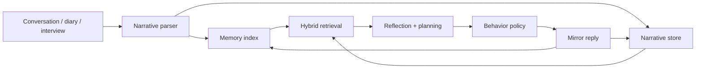

<div align="center">
  
  <h1>Alter Emo — AI Mirror</h1>
  <p><strong>A reflective AI experience built from narrative memory, emotion, and the user's own communication patterns.</strong></p>
  <p><a href="https://liang-tian.com/works/aimirror">Full interactive case study →</a></p>
</div>

## Overview

Alter Emo explores what an AI companion could become when it does more than answer the current prompt. The project creates an evolving pixel-self from memories, daily narratives, feelings, choices, and ways of speaking that the user intentionally shares.

The goal is not to produce a perfect digital copy. It is to create a partial, transparent mirror that helps a person notice recurring patterns, revisit meaningful experiences, and make future choices with greater clarity.

> This repository documents the product concept, interaction model, and agent architecture. Private user data and production credentials are not included.

## The problem

Everyday experiences are fragmented across conversations, notes, emotions, and decisions. Conventional chat systems usually respond well to a single question, but rarely reconnect the long-term narrative: what repeatedly matters, how a person frames experience, and why similar choices return.

Alter Emo asks:

- How can an agent remember without reducing a person to a fixed profile?
- How can raw life stories and structured memory work together?
- How should a mirror-like agent choose when to ask, reframe, nudge, or simply reflect?
- How can an embodied interface make long-term reflection feel present without pretending to be the real person?

## Experience

The user meets a pixel character inside a Godot room. Everyday chat, diary-like input, and adaptive interviews gradually build a mirror-self. The character can recall relevant narrative windows, identify emotional and behavioral patterns, plan an appropriate response action, and write the new exchange back into memory.

The system is designed around user agency: the mirror grows only from material the user chooses to share.

## System architecture



### 1. Conversation capture

Godot presents the room, avatar movement, dialogue, recording state, and embodied cues. Flask coordinates conversational input, daily notes, adaptive interview questions, generated replies, and file export.

### 2. Dual memory representation

- **Structured memory nodes** support retrieval through event, topic, emotion, salience, and time.
- **Narrative windows** retain the surrounding story, language, framing, and conversational context.

This keeps the system searchable without throwing away the user's original voice.

### 3. Hybrid retrieval

Candidate memories are ranked using four signals:

| Signal | Weight | Purpose |
| --- | ---: | --- |
| Semantic similarity | 55% | Finds experiences with related meaning |
| Emotional similarity | 20% | Recovers a comparable affective state |
| Salience | 15% | Prioritizes personally significant events |
| Recency | 10% | Preserves continuity with recent experience |

After ranking, the system reopens the nearby narrative window rather than responding from an isolated memory summary.

### 4. Reflection and behavior policy

Retrieved evidence becomes a short reflection plan. A behavior policy then selects an interaction intent—ask, reframe, nudge, mirror, or pause—before the model writes the final response. This separates *what the agent should do* from *how the final sentence should sound*.

## Technology

- **Godot:** embodied room, pixel avatar, interaction and dialogue states
- **Flask / Python:** orchestration, memory services, interviews, and export
- **GPT:** adaptive conversation, extraction, reflection, planning, and response generation
- **Structured files + embeddings:** persistent memory nodes, narrative windows, and retrieval

## Responsible design boundaries

- The interface identifies the character as a mirror, not the real person.
- New claims from a visitor do not silently become facts about the owner.
- The agent should not invent private memories or relationships.
- Memory should be inspectable, correctable, and removable by the user.
- Sensitive deployments require explicit retention, consent, and escalation policies.

## What I learned

The strongest sense of continuity did not come from saving more text. It came from restoring the right narrative context and selecting an appropriate response action before generation. Memory quality, behavior policy, and communication style need to be designed as separate layers.

## Status

Interactive research prototype and portfolio case study. The public demo uses curated public memory; it does not expose a visitor's conversation history to the portfolio owner.

## Source code

This repository includes the working Python core used by the prototype:

- `src/mirror_agent.py` — command-line mirror chat and dual-channel retrieval
- `src/interview_agent.py` — adaptive interview and memory extraction
- `src/agent_io.py` — agent, session, and memory persistence helpers
- `src/build_agent.py` — persona workspace creation
- `examples/` — example interview and MBTI prompt pools

Private interview sessions, embeddings, recordings, generated agent memories, and API credentials are intentionally excluded.

### Run locally

```bash
python -m venv .venv
# Windows: .venv\Scripts\activate
# macOS/Linux: source .venv/bin/activate
pip install -r requirements.txt
copy .env.example .env  # use `cp` on macOS/Linux
python src/mirror_agent.py
```

Add your own `OPENAI_API_KEY` to `.env`. Runtime memory is written under `agents/`, which is ignored by Git.

### List personas

```bash
python src/mirror_agent.py --list
```

### Start a named mirror session

```bash
python src/mirror_agent.py --id demo-persona --interlocutor self
```

## Author

Designed and developed by [Liang Tian](https://liang-tian.com).
